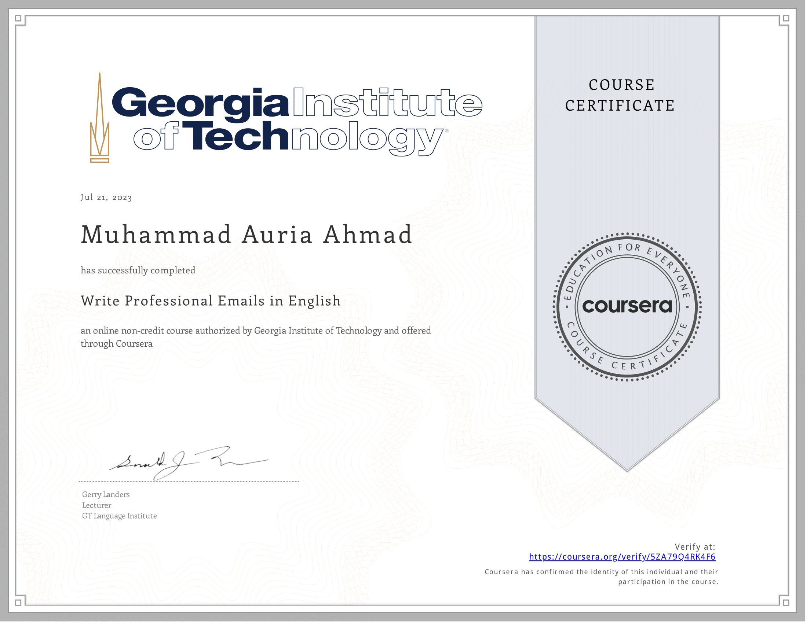

# Mastering Effective Communication ✉️
[Varify](https://coursera.org/share/a1ddee228ec0d848321980454d804ddb)

## Writing Professional Emails in English! 🚀

Hey there! 👋 I'm excited to share that I've recently completed an Email Writing course from **Georgia Institute of Technology.** 📚

## Why I took this Certification 🗣️
I feel effective communication is more than just words:

🌐 **Workplace:** Clear emails are like teamwork boosters, making collaboration a breeze. 🤝

🌱 **Career:** Strong communication paints you as adaptable and go-getting, which is essential for growth. 📈
### Key Takeaways
- Reviewing and perfecting professional email structures in English.
- Mastering essential dos and don'ts for professional emails.
- Polishing punctuation, capitalization, and text organization.
- Crafting effective subject lines and compelling email content.
- Navigating nuances of introductions, announcements, requests, and apologies.
- Employing cultural sensitivity in email communication.

💡 **Problem Solving:** Listening actively helps not just to understand but also to solve challenges smartly. 🧠

🌈 **Life:** From friendships to meetings, good communication colors every interaction beautifully. 🤗

## Let's Connect! 🤝
If you're into the magic of communication too, let's connect on LinkedIn and chat about it! 👥
[Connect on LinkedIn](https://www.linkedin.com/in/muhammad-auria-ahmad/)
